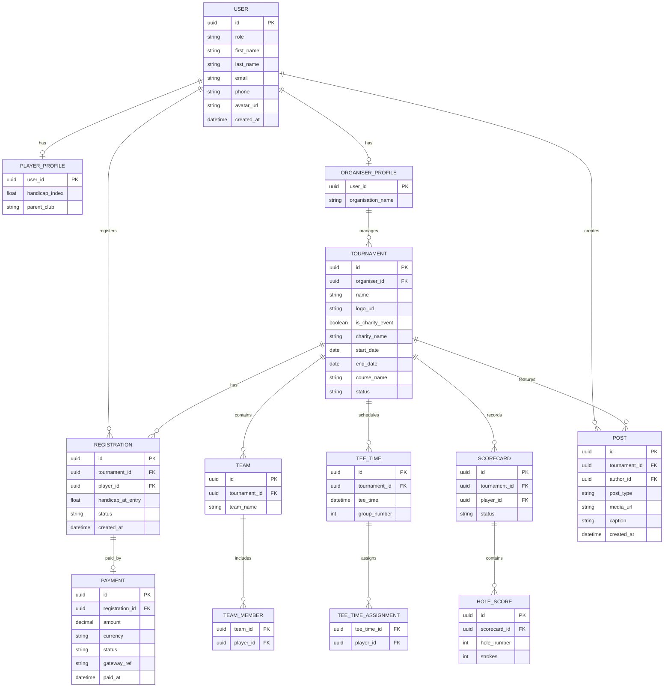

# GoLaugh Tournament App

Source: `C:\Users\ssbih\Downloads\GoLaugh Tournament App (18Jan2026).PDF`

We're basically developing a full tournament operations + marketing + community platform for golf (not just a scoring app).
Have structured this so it's actually buildable and scalable.

- product scope
- core modules
- recommended MVP vs Phase 2
- tech + architecture suggestions

## 1. Product Vision

Our app sits at the intersection of:

- Tournament management system
- Player registration & scoring
- Social & content platform
- Sponsor & commerce engine

(Think: Golf Genius + Eventbrite + Instagram-lite + Shopify-lite, but golf-specific).

## 2. Core Modules

### A. User & Identity Management

User types

- Player
- Organiser
- Sponsor
- Admin

Player profile

- Personal particulars
- Contact details
- Handicap (manual + optional GHIN/WHI integration later)
- Parent club
- Playing history
- Privacy controls

Organiser profile

- Organisation details
- Payment/bank info
- Tournament history

### B. Tournament Setup & Management

Tournament details

- Name, logo, banner
- Date(s), course(s), tees
- Format(s):
  - Stroke play
  - Stableford
  - Fourball
  - Better ball
  - Scramble
  - Match play
  - Mixed formats / multi-round
- Charity / fundraiser flag
- Beneficiary details & messaging

Registration rules

- Entry fees
- Max players / waitlist
- Handicap limits
- Team vs individual entry
- Optional extras (dinner, merch, mulligans, charity add-ons)

### C. Payments & Fundraising

- Entry fee payments
- Split payments (entry + charity donation)
- Promo codes / early bird pricing
- Refund & cancellation rules
- Payment gateways (Stripe / PayPal to start)
- Payout reporting for organisers & charities

### D. Fourball & Draw Scheduling

Scheduling engine

- Random draw
- Handicap-based seeding
- Team balancing
- Manual overrides
- Tee time allocation
- Multi-round reshuffling

Support

- All standard fourball combinations
- Team & individual scoring formats
- Live updates when players withdraw

### E. Scoring & Results

Score capture

- Hole-by-hole input
- Gross / net calculation
- Auto Stableford points
- Team aggregation logic
- Live leaderboard

Results

- Overall winners
- Flight winners
- On-the-day prizes (nearest pin, longest drive)
- Exportable results (PDF / CSV)
- Historical records per player

### F. Social & Community Layer

In-tournament

- Photo sharing
- Anecdotes / highlights
- Like / comment / share
- Tag players & sponsors

Promotion

- Social media linking (share to Instagram, Facebook, WhatsApp)
- Auto-generated event promo pages
- Post-tournament recap blog

### G. Content, Blogs & Announcements

- Organiser announcements (push + in-app)
- Blogs & stories
- Tournament updates (weather, tee changes)
- Sponsor content placement

### H. eCommerce & Promotions

- Merchandise sales
- Sponsor offers & vouchers
- Affiliate links
- In-app featured promotions
- Limited-time tournament deals

### I. Sponsors & External Links

- Sponsor profile pages
- Logo placement tiers
- Click-through tracking
- External website links
- Analytics for sponsors (views, clicks, conversions)

## 3. MVP vs Phase 2

### MVP (Launch with this)

- Player profiles
- Tournament creation
- Registration + payments
- Fourball draw (basic)
- Score capture
- Leaderboards & results
- Simple sponsor logo + link
- Basic social sharing (photos + links)

This alone is already a strong product.

### Phase 2 Enhancements

- Advanced scheduling logic
- Charity fundraising mechanics
- Blogs & long-form content
- eCommerce
- Deep sponsor analytics
- Multi-tournament series / leagues
- Handicap system integrations
- White-label tournaments for corporates

## 4. Tech & Architecture

### Frontend

- Mobile-first (this lives on the course)
- React Native or Flutter
- Web admin panel for organisers

### Backend

- Node.js / NestJS or Django
- REST + WebSockets (live scoring)
- Modular services:
  - Users
  - Tournaments
  - Payments
  - Scoring
  - Content
  - Commerce

### Database

- PostgreSQL (relational fits tournaments well)
- Redis for live leaderboards

### Payments

- Stripe (best flexibility)
- Separate escrow logic for charity payouts

### Media

- Cloud storage (S3 / Cloudinary)
- Image compression + moderation hooks

### Analytics

- Event tracking (registrations, clicks, shares)
- Sponsor reporting dashboards

## 5. Key Risks & Things to Decide Early

- Handicap accuracy & disputes
- Offline scoring fallback
- Data privacy (player contact details)
- Refund & cancellation edge cases
- Scoring rule edge cases per format
- Moderator tools for social content

## Core Data Model

Described as logical tables / collections (works for SQL or ORM models).

### A. Users & Identity

#### User

- `id` (PK)
- `role` (PLAYER | ORGANISER | SPONSOR | ADMIN)
- `first_name`
- `last_name`
- `email` (unique)
- `phone`
- `password_hash / auth_provider`
- `avatar_url`
- `status` (active, suspended)
- `created_at`

One-to-one with role-specific profile.

#### PlayerProfile

- `user_id` (PK, FK -> User)
- `handicap_index`
- `parent_club`
- `gender`
- `date_of_birth`
- `home_country`
- `bio`
- `privacy_settings` (JSON)

One-to-many -> Registrations, Scores, Photos.

#### OrganiserProfile

- `user_id` (PK)
- `organisation_name`
- `organisation_type` (club, corporate, charity)
- `contact_email`
- `payout_account_id`
- `verification_status`

#### SponsorProfile

- `user_id` (PK)
- `business_name`
- `logo_url`
- `website_url`
- `description`
- `contact_person`
- `tier` (gold/silver/bronze)

### B. Tournament & Event Structure

#### Tournament

- `id` (PK)
- `organiser_id` (FK -> User)
- `name`
- `logo_url`
- `banner_url`
- `description`
- `is_charity_event` (bool)
- `charity_name`
- `charity_description`
- `start_date`
- `end_date`
- `course_name`
- `status` (DRAFT | OPEN | CLOSED | LIVE | COMPLETED)
- `created_at`

#### TournamentFormat

- `id` (PK)
- `tournament_id` (FK)
- `format_type` (stroke, stableford, scramble, match_play)
- `is_team_based` (bool)
- `handicap_allowance_pct`
- `ruleset` (JSON)

(Allows mixed formats across rounds)

#### TournamentRound

- `id`
- `tournament_id`
- `round_number`
- `date`
- `tee_time_start`
- `course_setup` (tees, pars, SI)

### C. Registration & Payments

#### Registration

- `id`
- `tournament_id`
- `player_id` (FK -> User)
- `team_id` (nullable)
- `handicap_at_entry`
- `status` (PENDING | CONFIRMED | CANCELLED | WAITLIST)
- `paid_amount`
- `created_at`

#### Payment

- `id`
- `registration_id`
- `payer_id`
- `amount`
- `currency`
- `payment_type` (ENTRY | DONATION | MERCH)
- `gateway_ref`
- `status`
- `processed_at`

### D. Teams & Draws

#### Team

- `id`
- `tournament_id`
- `team_name`
- `created_by` (organiser/system)

#### TeamMember

- `team_id`
- `player_id`
- `position` (optional)

#### TeeTime

- `id`
- `tournament_round_id`
- `tee_time`
- `hole_start`
- `group_number`

#### TeeTimeAssignment

- `tee_time_id`
- `player_id`
- `team_id` (nullable)

### E. Scoring & Results

#### Scorecard

- `id`
- `tournament_round_id`
- `player_id`
- `team_id`
- `submitted_by`
- `status` (IN_PROGRESS | SUBMITTED | VERIFIED)

#### HoleScore

- `id`
- `scorecard_id`
- `hole_number`
- `strokes`
- `stableford_points`
- `net_score`

#### Leaderboard

- `id`
- `tournament_id`
- `category` (overall, flight, team)
- `calculated_at`

(Usually computed, not stored)

### F. Social & Content

#### Post

- `id`
- `tournament_id`
- `author_id`
- `post_type` (PHOTO | STORY | ANNOUNCEMENT)
- `caption`
- `media_url`
- `created_at`
- `visibility`

#### Reaction

- `post_id`
- `user_id`
- `type` (like, clap, etc.)

#### Comment

- `post_id`
- `user_id`
- `comment_text`
- `created_at`

### G. Sponsors, Promotions & eCommerce

#### SponsorPlacement

- `id`
- `tournament_id`
- `sponsor_id`
- `placement_type` (banner, hole, leaderboard)
- `click_url`

#### Product

- `id`
- `organiser_id`
- `name`
- `description`
- `price`
- `stock_qty`
- `active`

#### Order

- `id`
- `buyer_id`
- `total_amount`
- `status`
- `created_at`

#### OrderItem

- `order_id`
- `product_id`
- `quantity`
- `unit_price`

## User Flow Per Role

### Player Flow

Onboarding

1. Sign up
2. Create player profile (handicap, club)
3. Set privacy preferences

Discovery

4. Browse tournaments
5. View tournament details & sponsors

Registration

6. Register (individual / team)
7. Pay entry fee
8. Receive confirmation + tee info

During Tournament

9. View tee time
10. Enter scores (self or marker)
11. Track live leaderboard
12. Share photos & stories

Post Tournament

13. View results
14. Download scorecard
15. Share highlights
16. Purchase merch / sponsor offers

### Organiser Flow

Setup

1. Register as organiser
2. Create tournament (draft)
3. Define formats, rounds, rules
4. Open registrations
5. Add sponsors & promotions

Pre-Event

6. Monitor entries & payments
7. Generate draws & tee times
8. Communicate updates

Event Day

9. Monitor live scoring
10. Resolve disputes / edits
11. Publish announcements

Post-Event

12. Lock scores
13. Publish results
14. Trigger payouts
15. Post recap blog

### Sponsor Flow

Onboarding

1. Create sponsor profile
2. Upload branding
3. Choose placements

Engagement

4. View tournament exposure
5. Post offers or promotions
6. Track clicks & views

Conversion

7. Redirect users to website
8. Offer discount codes

### Admin Flow

1. User management
2. Tournament moderation
3. Content moderation
4. Payment dispute handling
5. System configuration
6. Analytics & reporting

## Design Notes (Important)

- Keep scoring & leaderboard derived. Don't hard-store results; calculate dynamically to avoid rule conflicts.
- JSON fields are intentional. Formats, rules, privacy settings change over time.
- Offline-first scoring. Cache scorecards locally and sync when online.

## ER Diagram (Phase-1 Focused)

This diagram intentionally excludes blogs, eCommerce, advanced sponsor analytics, and complex multi-round logic. It covers what we must ship first.



## Phase-1 Database Schema (Ship-This-Month Version)

### Principles

- PostgreSQL
- UUID primary keys
- No over-normalisation
- No premature abstraction
- Everything supports single-round tournaments

### 1. Users

```sql
CREATE TABLE users (
  id UUID PRIMARY KEY,
  role TEXT CHECK (role IN ('PLAYER','ORGANISER','ADMIN')) NOT NULL,
  first_name TEXT,
  last_name TEXT,
  email TEXT UNIQUE NOT NULL,
  phone TEXT,
  avatar_url TEXT,
  created_at TIMESTAMP DEFAULT NOW()
);
```

### 2. Profiles

```sql
CREATE TABLE player_profiles (
  user_id UUID PRIMARY KEY REFERENCES users(id),
  handicap_index NUMERIC(4,1),
  parent_club TEXT
);

CREATE TABLE organiser_profiles (
  user_id UUID PRIMARY KEY REFERENCES users(id),
  organisation_name TEXT NOT NULL
);
```

### 3. Tournaments

```sql
CREATE TABLE tournaments (
  id UUID PRIMARY KEY,
  organiser_id UUID REFERENCES users(id),
  name TEXT NOT NULL,
  logo_url TEXT,
  is_charity_event BOOLEAN DEFAULT FALSE,
  charity_name TEXT,
  start_date DATE,
  end_date DATE,
  course_name TEXT,
  status TEXT CHECK (status IN ('DRAFT','OPEN','LIVE','COMPLETED')) DEFAULT 'DRAFT',
  created_at TIMESTAMP DEFAULT NOW()
);
```

### 4. Registration & Payments

```sql
CREATE TABLE registrations (
  id UUID PRIMARY KEY,
  tournament_id UUID REFERENCES tournaments(id),
  player_id UUID REFERENCES users(id),
  handicap_at_entry NUMERIC(4,1),
  status TEXT CHECK (status IN ('PENDING','CONFIRMED','CANCELLED')),
  created_at TIMESTAMP DEFAULT NOW()
);

CREATE TABLE payments (
  id UUID PRIMARY KEY,
  registration_id UUID REFERENCES registrations(id),
  amount NUMERIC(10,2),
  currency TEXT DEFAULT 'USD',
  status TEXT CHECK (status IN ('PAID','FAILED','REFUNDED')),
  gateway_ref TEXT,
  paid_at TIMESTAMP
);
```

### 5. Teams & Tee Times (Simple Fourballs)

```sql
CREATE TABLE teams (
  id UUID PRIMARY KEY,
  tournament_id UUID REFERENCES tournaments(id),
  team_name TEXT
);

CREATE TABLE team_members (
  team_id UUID REFERENCES teams(id),
  player_id UUID REFERENCES users(id),
  PRIMARY KEY (team_id, player_id)
);

CREATE TABLE tee_times (
  id UUID PRIMARY KEY,
  tournament_id UUID REFERENCES tournaments(id),
  tee_time TIMESTAMP,
  group_number INT
);

CREATE TABLE tee_time_assignments (
  tee_time_id UUID REFERENCES tee_times(id),
  player_id UUID REFERENCES users(id),
  PRIMARY KEY (tee_time_id, player_id)
);
```

### 6. Scoring (Single Round, Individual)

```sql
CREATE TABLE scorecards (
  id UUID PRIMARY KEY,
  tournament_id UUID REFERENCES tournaments(id),
  player_id UUID REFERENCES users(id),
  status TEXT CHECK (status IN ('IN_PROGRESS','SUBMITTED','VERIFIED'))
);

CREATE TABLE hole_scores (
  id UUID PRIMARY KEY,
  scorecard_id UUID REFERENCES scorecards(id),
  hole_number INT CHECK (hole_number BETWEEN 1 AND 18),
  strokes INT
);
```

### 7. Social (Lightweight)

```sql
CREATE TABLE posts (
  id UUID PRIMARY KEY,
  tournament_id UUID REFERENCES tournaments(id),
  author_id UUID REFERENCES users(id),
  post_type TEXT CHECK (post_type IN ('PHOTO','ANNOUNCEMENT')),
  media_url TEXT,
  caption TEXT,
  created_at TIMESTAMP DEFAULT NOW()
);
```

### Phase-1 Delivers

- Player registration
- Payments
- Tee time & fourball grouping
- Score capture
- Leaderboards (computed)
- Tournament social feed

Not in Phase-1:

- Blogs
- eCommerce
- Multi-round logic
- Advanced sponsor analytics

## Leaderboard Calculation (Queries & Logic)

### 1. Rule for Phase-1

- Single round
- Individual stroke play
- Optional Stableford (derived)
- Leaderboard is computed, not stored

### A. Gross Stroke Leaderboard

SQL (Postgres-style)

```sql
SELECT
 u.id AS player_id,
 u.first_name,
 u.last_name,
 SUM(hs.strokes) AS total_strokes
FROM scorecards sc
JOIN hole_scores hs ON hs.scorecard_id = sc.id
JOIN users u ON u.id = sc.player_id
WHERE sc.tournament_id = :tournament_id
AND sc.status IN ('SUBMITTED','VERIFIED')
GROUP BY u.id
ORDER BY total_strokes ASC;
```

### B. Net Score (Handicap Applied)

Net = Gross - Handicap (simplified Phase-1)

```sql
SELECT
 u.id,
 u.first_name,
 u.last_name,
 SUM(hs.strokes) - r.handicap_at_entry AS net_score
FROM scorecards sc
JOIN hole_scores hs ON hs.scorecard_id = sc.id
JOIN registrations r ON r.player_id = sc.player_id
JOIN users u ON u.id = sc.player_id
WHERE sc.tournament_id = :tournament_id
GROUP BY u.id, r.handicap_at_entry
ORDER BY net_score ASC;
```

### C. Stableford (Basic)

Phase-1 assumption

- Course par fixed at 72
- No per-hole SI yet

`points = 2 + (par - net_score_on_hole)`

You compute this in backend code, not SQL, for flexibility.

### 2. Fourball Draw Algorithm (Phase-1)

Goal

- Groups of 4
- Simple & fair
- Deterministic

Algorithm: Handicap-Banded Random Draw

Steps

1. Fetch confirmed registrations
2. Sort players by handicap ASC
3. Split into quartiles
4. Randomly pick one from each quartile per group

Pseudocode

```text
players.sort(byHandicap);

bands = splitIntoBands(players, 4);

groups = [];

while (bands not empty) {
  group = [
    randomPick(bands[0]),
    randomPick(bands[1]),
    randomPick(bands[2]),
    randomPick(bands[3])
  ];
  groups.push(group);
}
```

Tee Time Assignment

- Group 1 -> 08:00
- Group 2 -> 08:08
- Group 3 -> 08:16

Store in:

- `tee_times`
- `tee_time_assignments`

### 3. REST API Endpoints (Phase-1)

Auth

- `POST /auth/register`
- `POST /auth/login`
- `GET /me`

Player

- `GET /tournaments`
- `GET /tournaments/{id}`
- `POST /tournaments/{id}/register`
- `GET /me/registrations`

Organiser

- `POST /tournaments`
- `PUT /tournaments/{id}`
- `POST /tournaments/{id}/open`
- `POST /tournaments/{id}/draw`
- `POST /tournaments/{id}/publish-tee-times`

Scoring

- `POST /scorecards`
- `PUT /scorecards/{id}/holes`
- `POST /scorecards/{id}/submit`
- `GET /tournaments/{id}/leaderboard`

Social

- `POST /posts`
- `GET /tournaments/{id}/posts`

### 4. Offline Scoring Sync Strategy (Critical)

On-course reality

- Spotty signal
- Phone dies
- Rage ensues

Strategy: Local-First Scorecards

Client

- Store scorecard in local storage / SQLite
- Timestamp every hole entry
- Allow edits until submission

Server Sync

```text
IF scorecard exists:
  merge hole scores (last-write-wins)
ELSE:
  create scorecard
```

Submission Lock

- Once `SUBMITTED`, client switches to read-only
- Organiser can unlock (admin override)

Conflict Handling (Phase-1)

- Marker & player edits overwrite until submit
- No dual-entry reconciliation yet

## UI Wireframes (Per Role - Textual)

### Player UI

Home

```text
[Upcoming Tournament Card]
[My Tee Time]
[Leaderboard Button]
```

Scoring

```text
Hole | Par | Strokes [+][-]
--------------------------
 1   | 4   | 5
```

Leaderboard

```text
1. Smith 72
2. Jones 74
```

### Organiser UI

Dashboard

```text
[Tournament Status]
[Registrations: 84]
[Payments: Complete]
```

Draw Screen

```text
[Generate Draw]
[Drag & Drop Groups]
[Publish Tee Times]
```

Live View

```text
Player    Thru    Score
Smith     12      +1
```

### Admin UI (Minimal Phase-1)

```text
[User Search]
[Tournament List]
[Force Close Tournament]
```

## Phase-1 MVP Sprint Plan (6 Weeks)

### MVP Goal

By end of Sprint 3: An organiser can create a tournament, players can register & pay, organiser can generate fourballs and tee times, players can submit scores (offline), and everyone can see a live leaderboard.

### Sprint 0 - Setup & Foundations (3-5 days)

Objectives

- Avoid chaos later
- Get deployment + CI sorted early

Tasks

Tech setup

- Repo(s) created
- Backend framework scaffolded
- Mobile/web frontend scaffolded
- Environment configs (dev / staging)

Core infra

- PostgreSQL database
- Auth system (email + password)
- UUID strategy
- Role-based access control

Deliverables

- Users can register & login
- `/me` endpoint works
- App deploys to staging

### Sprint 1 - Tournaments, Registration & Payments

Theme: "People can sign up and pay"

Backend

- Users & profiles (player / organiser)
- Tournament CRUD
- Tournament status lifecycle
- Registration logic
- Payment integration (Stripe sandbox)
- Registration -> payment confirmation flow

Frontend

- Player onboarding (profile)
- Tournament list & detail view
- Registration + payment screen
- Organiser tournament creation form

Data

- `users`
- `player_profiles`
- `organiser_profiles`
- `tournaments`
- `registrations`
- `payments`

Acceptance Criteria

- Player registers
- Organiser creates tournament
- Player pays & registration confirmed
- Organiser sees registration list

### Sprint 2 - Draws, Tee Times & Scoring (Core Golf Logic)

Theme: "We can actually run a tournament"

Backend

- Fourball draw algorithm
- Tee time generation
- Team & tee time persistence
- Scorecard creation
- Hole-by-hole score submission
- Leaderboard queries

Frontend

- Tee time view (player)
- Organiser draw screen
- Score entry UI
- Live leaderboard UI

Data

- `teams`
- `team_members`
- `tee_times`
- `tee_time_assignments`
- `scorecards`
- `hole_scores`

Acceptance Criteria

- Organiser generates draw
- Tee times published
- Player sees tee time
- Player enters scores
- Leaderboard updates correctly

### Sprint 3 - Offline Scoring, Social Feed & Polish

Theme: "Works on a golf course"

Backend

- Offline score sync endpoint
- Scorecard locking logic
- Admin overrides
- Post creation (photos & announcements)

Frontend

- Offline local score storage
- Sync indicator (offline / online)
- Tournament feed
- Photo upload & display

Data

- `posts`

Acceptance Criteria

- Scores enter offline & sync later
- Submitted scores lock
- Organiser can unlock scorecards
- Tournament has a social feed

### Cross-Sprint Tasks

- Basic validation & error handling
- Logging & monitoring
- Seed test tournaments
- Manual happy-path testing
- Data backup scripts

### Final MVP Feature Checklist - By end of Sprint 3

- Player profiles
- Tournament creation
- Registration + payments
- Fourball draw
- Tee times
- Score capture (offline-first)
- Leaderboards
- Social feed (light)

## Phase-2 Backlog (Post-MVP)

Keep this parked:

- Multi-round tournaments
- Team scoring formats
- Stableford & match play
- Blogs & long-form content
- eCommerce & merch
- Sponsor analytics
- Handicap system integration

## Phase-1 MVP Release Checklist: Golf Tournament App

### Product Readiness (Must-Have)

Core User Flows

- Player can sign up, log in, log out
- Player profile creation/edit works
- Organiser profile creation works
- Organiser can create a tournament
- Tournament status transitions work (Draft -> Open -> Live -> Completed)
- Player can view tournaments
- Player can register for a tournament
- Registration confirmation visible to player & organiser

Payments

- Payment gateway in production mode
- Successful payment marks registration as `CONFIRMED`
- Failed payment handled gracefully
- Payment receipt/confirmation visible in UI
- Duplicate payments prevented
- Refund path documented (manual ok for Phase-1)

Tournament Operations

- Organiser can generate fourball draw
- Draw persists correctly
- Tee times can be published
- Players see correct tee time
- Withdrawn players handled cleanly

Scoring & Results

- Scorecards created automatically for all players
- Hole-by-hole scoring works
- Offline score entry works
- Offline scores sync correctly
- Scorecard submit locks further edits
- Organiser/admin can unlock scorecard
- Gross leaderboard correct
- Net leaderboard correct (if enabled)
- Ties handled consistently

Social Feed

- Players can post photos
- Posts display in tournament feed
- Announcements visible to all players
- Image uploads compressed & stored
- Basic content moderation tools exist

Data Integrity & Safety

- All tables have primary keys
- Foreign key constraints enforced
- Orphaned records prevented
- Unique constraints enforced (email, registrations)
- Handicaps captured at registration (immutable)
- Scorecards linked to correct tournament
- Soft deletes or status flags used (no hard deletes)

Security & Access Control

- Role-based access enforced
- Players cannot edit tournaments
- Organisers cannot access other organisers' tournaments
- Admin-only actions protected
- Auth tokens expire correctly
- Passwords hashed securely
- File uploads validated (type & size)
- Payment webhooks verified
- Rate limiting enabled on auth endpoints

Performance & Reliability

- Tournament list loads under 2s
- Leaderboard query performant under load
- Indexes added on:
- `registrations.tournament_id`
- `scorecards.tournament_id`
- `hole_scores.scorecard_id`
- Offline sync retry logic tested
- Graceful handling of network drops

UX & Edge Cases (Very Important)

- Empty states handled (no tournaments, no scores)
- Loading states visible
- Error messages human-readable
- Double-tap submission prevented
- Timezone handling verified
- Tee times display correctly for locale
- Accessibility basics (contrast, tap size)

Admin & Ops

- Admin can view all users
- Admin can view all tournaments
- Admin can force close a tournament
- Admin can unlock scorecards
- Admin can disable abusive users
- Manual data fix procedures documented

Monitoring, Logging & Backup

- Error logging enabled (backend + frontend)
- Payment failures logged
- Score submission events logged
- Basic analytics enabled
- Daily DB backups scheduled
- Restore process tested once

Deployment & Environment

- Production environment configured
- Environment variables verified
- Stripe keys correct
- Storage buckets locked down
- Domain & SSL configured
- App version tagged
- Rollback plan documented

Legal & Compliance (Light Phase-1)

- Privacy policy published
- Terms of use published
- Photo/content consent included
- Payment terms visible
- GDPR basics covered (data access & deletion path)

### Launch Day Checklist

Before Launch

- Final smoke test on production
- Test tournament created
- Test payment completed
- Admin accounts verified

Launch

- Enable registrations
- Monitor logs & payments
- Monitor leaderboard load
- Be available during first live event

After Launch

- Review error logs
- Review payment reconciliation
- Capture user feedback
- Patch hotfixes quickly

## First-Tournament Dry-Run Checklist

(Run this 3-7 days before the actual event)

Goal

Simulate a real tournament end-to-end with test users, test payments, tee times, scoring, and results before real players are involved.

### 1. Tournament Setup (Organiser)

- Create tournament in production
- Upload logo & banner
- Set dates, course, and status
- Enable registrations
- Configure charity flag (if applicable)
- Add organiser contact info

Pass if: Tournament looks correct to a player.

### 2. Player Registration & Payment (Test Accounts)

- Register at least 8 test players
- Use different handicap values
- Complete test payments
- Confirm registrations show as `CONFIRMED`
- Attempt duplicate registration (should fail)
- Cancel one registration

Pass if: All statuses update correctly.

### 3. Draw & Tee Time Simulation

- Generate fourball draw
- Verify groups are balanced by handicap
- Manually adjust one group
- Publish tee times
- Player sees correct tee time
- Withdraw a player and regenerate draw

Pass if: No orphaned players or broken groups.

### 4. Scoring Dry-Run (Most Important)

Online

- Create scorecards
- Enter full 18 holes for 1 player
- Submit scorecard
- Verify it locks

Offline

- Put phone in airplane mode
- Enter scores for another player
- Re-enable internet
- Sync scores
- Confirm no data loss

Pass if: Scores persist and submit cleanly.

### 5. Leaderboards & Results

- Verify gross leaderboard order
- Verify net leaderboard (if enabled)
- Create tie scenario
- Confirm tie handling rules
- Refresh leaderboard under load (multiple devices)

Pass if: Leaderboard matches manual calculation.

### 6. Social & Comms

- Post an announcement
- Upload a photo
- Confirm feed visible to all players
- Verify image loads on mobile networks

Pass if: Content loads fast and clean.

### 7. Admin & Recovery Scenarios

- Unlock a submitted scorecard
- Edit a hole score
- Re-lock scorecard
- Force close tournament
- Reopen tournament (if allowed)

Pass if: Admin tools work without side effects.

### 8. Payment Reconciliation

- Confirm payment totals
- Match registrations to payments
- Test manual refund (document process)
- Export payment list

Pass if: No mismatches.

### 9. Final Go / No-Go Decision

Greenlight only if:

- Scoring works offline
- Payments reconcile
- Leaderboard is accurate
- Admin can recover from mistakes

## Post-Launch Incident Response Plan

### Objective

Minimise damage to fairness, money, and trust during live tournaments.

### Incident Severity Levels

SEV-1 (Critical)

- Payments failing
- Scores lost or corrupted
- Leaderboard incorrect
- App down during live play

SEV-2 (Major)

- Tee times incorrect
- Scores delayed
- Some users unable to log in

SEV-3 (Minor)

- UI bugs
- Social feed issues
- Cosmetic errors

### Incident Response Team (Phase-1)

- Incident Lead
- Comms Lead
- Tech Support

### 1. Detection

Sources

- Error logs
- Payment webhook failures
- Organiser/player reports
- Leaderboard discrepancies

Immediate Action

- Log incident time
- Assign severity
- Freeze risky operations if needed

### 2. Containment

For SEV-1

- Pause scoring submissions
- Lock leaderboard visibility
- Disable new payments
- Communicate: "Temporary issue - scores safe"

For SEV-2

- Restrict affected feature only
- Allow tournament to continue if possible

### 3. Communication Templates

Player Message

> We're experiencing a temporary technical issue. Your scores and payments are safe. Please continue play - we'll update shortly.

Organiser Message

> Issue identified. Tournament fairness preserved. ETA update in 15 minutes.

Update every 15-30 minutes.

### 4. Resolution

- Identify root cause
- Apply fix or rollback
- Verify data integrity:
- Scores
- Payments
- Tee times
- Test fix on staging if possible
- Deploy hotfix

### 5. Recovery

- Re-enable locked features
- Recalculate leaderboards
- Confirm with organiser
- Notify players of resolution

### 6. Post-Incident Review (Within 48 Hours)

Document

- What happened
- Root cause
- Impacted users
- Resolution steps
- Prevention actions

Action Items

- Add automated tests
- Improve monitoring
- Update runbooks
